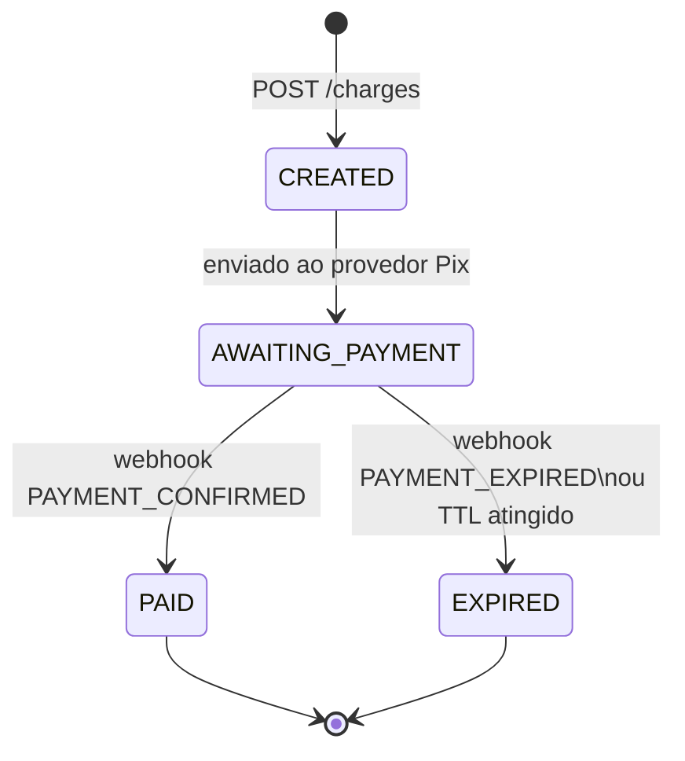
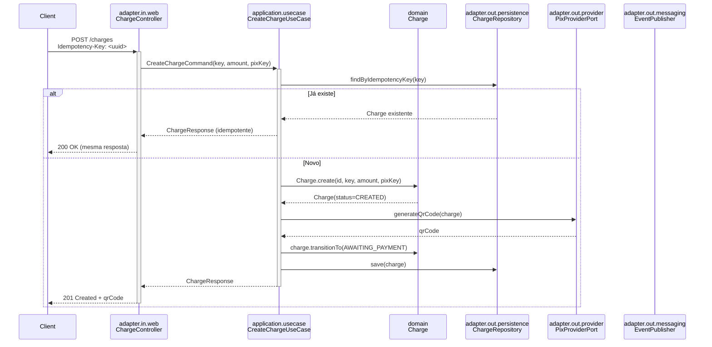
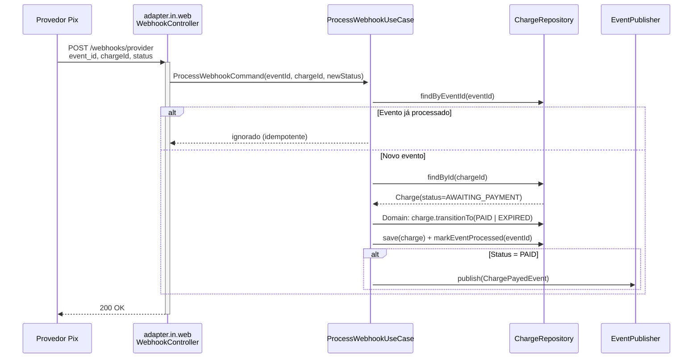

# Arquitetura — payment-api

> Espelho do [pix-payment-core](https://github.com/lmoraesdev/pix-payment-core) em Java com
> Clean Architecture pragmática. A lógica de negócio fica isolada no domínio; infraestrutura
> e framework ficam nas bordas.

---

## Domínio: Charge (Cobrança Pix)

### Entidade principal

```
Charge
├── id            : UUID           (gerado na criação)
├── idempotencyKey: String         (único — cliente envia no header)
├── amount        : Money          (value object — BigDecimal + "BRL")
├── pixKey        : String         (chave Pix do recebedor)
├── qrCode        : String         (gerado pelo provedor, retornado ao cliente)
├── status        : ChargeStatus   (máquina de estados — ver abaixo)
├── createdAt     : Instant
├── updatedAt     : Instant
└── expiresAt     : Instant        (TTL configurável, padrão 30 min)
```

### Value Object: Money

```
Money
├── amount  : BigDecimal  (escala 2, arredondamento HALF_UP)
└── currency: String      (fixo "BRL" por ora)
```

### Máquina de estados: ChargeStatus



> **Regra:** Não existe `setStatus()`. Apenas `transitionTo(newStatus)` com validação.
> Qualquer transição inválida lança `InvalidStateTransitionException` (subtipo de `DomainException`).

---

## Fluxo de uma cobrança (sequência)



### Webhook do provedor (deduplicação)



---

## Estrutura de pacotes

```
com.lmoraesdev.payment
│
├── domain/
│   ├── model/
│   │   ├── Charge.java              ← entidade + transitionTo()
│   │   ├── ChargeStatus.java        ← enum com lógica de transição válida
│   │   └── Money.java               ← value object
│   ├── event/
│   │   └── ChargePayedEvent.java    ← domain event publicado no Kafka
│   └── exception/
│       ├── DomainException.java          ← base abstrata (já existe)
│       ├── InvalidStateTransitionException.java
│       └── ChargeNotFoundException.java
│
├── application/
│   ├── usecase/
│   │   ├── CreateChargeUseCase.java
│   │   ├── ProcessWebhookUseCase.java
│   │   └── GetChargeUseCase.java
│   ├── port/
│   │   ├── in/                      ← interfaces que os controllers chamam
│   │   │   ├── CreateChargePort.java
│   │   │   ├── ProcessWebhookPort.java
│   │   │   └── GetChargePort.java
│   │   └── out/                     ← interfaces que os use cases dependem
│   │       ├── ChargeRepositoryPort.java
│   │       ├── PixProviderPort.java
│   │       └── EventPublisherPort.java
│
├── adapter/
│   ├── in/
│   │   └── web/
│   │       ├── ChargeController.java        ← POST /charges, GET /charges/{id}
│   │       ├── WebhookController.java       ← POST /webhooks/provider
│   │       ├── GlobalExceptionHandler.java  ← já existe
│   │       ├── PingController.java          ← smoke test, já existe
│   │       └── dto/
│   │           ├── CreateChargeRequest.java
│   │           ├── ChargeResponse.java
│   │           └── WebhookProviderPayload.java
│   └── out/
│       ├── persistence/
│       │   ├── ChargeJpaRepository.java     ← interface Spring Data JPA
│       │   ├── ChargeRepositoryAdapter.java ← implementa ChargeRepositoryPort
│       │   └── entity/
│       │       └── ChargeEntity.java        ← @Entity JPA, separado do domain
│       └── messaging/
│           └── KafkaEventPublisher.java     ← implementa EventPublisherPort
│
└── config/
    ├── logging/                             ← Logger5w1h (já existe)
    └── KafkaConfig.java                     ← topics, serializers (futuro)
```

---

## Contratos de API

### POST /charges
```
Headers:
  Idempotency-Key: <uuid>          (obrigatório)
  Content-Type: application/json

Body:
{
  "amount": 150.00,
  "pixKey": "leandro@email.com"
}

Response 201:
{
  "id": "uuid",
  "status": "AWAITING_PAYMENT",
  "qrCode": "00020126...",
  "expiresAt": "2026-06-03T15:30:00Z"
}

Response 200: (mesma resposta se Idempotency-Key já foi usada)
Response 422: transição de estado inválida ou valor inválido
```

### GET /charges/{id}
```
Response 200:
{
  "id": "uuid",
  "status": "PAID | AWAITING_PAYMENT | EXPIRED | CREATED",
  "amount": 150.00,
  "pixKey": "leandro@email.com",
  "createdAt": "...",
  "updatedAt": "..."
}

Response 404: charge não encontrada
```

### POST /webhooks/provider
```
Body:
{
  "eventId": "uuid",             (deduplicação)
  "chargeId": "uuid",
  "status": "PAYMENT_CONFIRMED | PAYMENT_EXPIRED"
}

Response 200: sempre, mesmo para eventos duplicados (idempotente)
```

---

## Kafka — tópicos e eventos

| Tópico | Evento | Publicado quando |
|---|---|---|
| `payments.charged` | `ChargePayedEvent` | Charge transiciona para `PAID` |

```json
// ChargePayedEvent
{
  "eventId": "uuid",
  "chargeId": "uuid",
  "amount": 150.00,
  "pixKey": "leandro@email.com",
  "occurredAt": "2026-06-03T15:00:00Z"
}
```

---

## Idempotência e Redis (futuro)

Redis está pré-instalado (`docker compose --profile cache up -d`).
Quando o domínio precisar:

| Uso | Chave Redis | TTL |
|---|---|---|
| Lock de criação | `idempotency:lock:{key}` | 30s |
| Cache de resposta | `idempotency:response:{key}` | 24h |
| Deduplicação de webhook | `webhook:seen:{eventId}` | 7d |

> Por enquanto a deduplicação de webhook usa constraint `UNIQUE(event_id)` no Postgres.
> Redis entra quando precisar de lock distribuído (múltiplas instâncias do app).

---

## Observabilidade

```
Requisição HTTP
    │
    ├── Log estruturado (5W1H + traceId) ──────────────► stdout / futuramente Loki
    │
    ├── Métricas Micrometer ────────────────────────────► Prometheus ──► Grafana
    │
    └── Trace OpenTelemetry (OTLP HTTP) ───────────────► Jaeger :16686
```

Todo log já carrega o `traceId` via MDC (`%X{traceId}` no pattern).
Com isso, é possível correlacionar log ↔ trace no Jaeger clicando num traceId.
