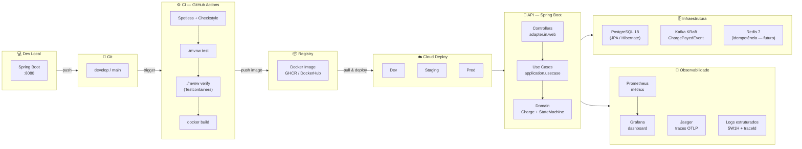

# DevOps Flow — payment-api

> Fluxo de desenvolvimento, CI/CD e observabilidade do projeto.

---

## Environments

| Env | Branch | Gatilho |
|---|---|---|
| Dev | `develop` | push → unit tests + lint |
| Staging / Prod | `main` | PR aprovado → full-verify + docker build |

## Observabilidade: Logs + Métricas + Traces

Toda requisição nasce com um **traceId** gerado pelo OpenTelemetry e propagado automaticamente:

- **Logs** — `application.yml` injeta `%X{traceId}` em cada linha via MDC
- **Métricas** — Micrometer → Prometheus → Grafana (dashboard `Payment — Overview`)
- **Traces** — Micrometer Tracing → OTLP HTTP → Jaeger (`:16686`)

> **Futuro:** Loki para log aggregation (completa o trio Logs + Métricas + Traces no Grafana).
